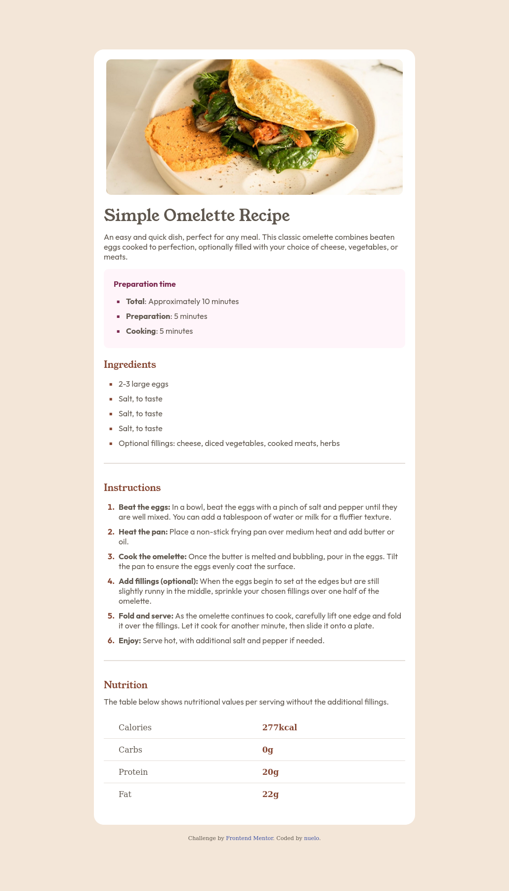

# Frontend Mentor - Recipe page solution

This is a solution to the [Recipe page challenge on Frontend Mentor](https://www.frontendmentor.io/challenges/recipe-page-KiTsR8QQKm). Frontend Mentor challenges help you improve your coding skills by building realistic projects. 

## Table of contents

- [Overview](#overview)
  - [The challenge](#the-challenge)
  - [Screenshot](#screenshot)
  - [Links](#links)
- [My process](#my-process)
  - [Built with](#built-with)
  - [What I learned](#what-i-learned)
  - [Continued development](#continued-development)
  - [Useful resources](#useful-resources)
- [Author](#author)
- [Acknowledgments](#acknowledgments)

## Overview
This is a static recipe web page
### The challenge

Ensure to use the most appropriate element based on the content. Do your own research.

### Screenshot

### Links

- Live Site URL: [Add live site URL here](socialmediahandles.netlify.app)

## My process

### Built with

- Semantic HTML5 markup
- CSS custom properties
- Flexbox
- CSS Grid
- Mobile-first workflow

### What I learned

I learnt how to use and style a table

### Continued development

I am still look at learn how to implement responsive designs

### Useful resources

- [Learn HTML!](https://web.dev/learn/html/) - This helped would help you with basic html
- [Learn CSS!](https://web.dev/learn/css/) - Another excellent (and free!) course from web.dev. This introduction to CSS is written and edited by a host of CSS experts. If you work through this course, you'll have excellent foundational knowledge.

## Author

- Website - [_nuelo](socialmediahandles.netlify.app)
- Frontend Mentor - [@_nuelo](https://www.frontendmentor.io/profile/NueloSE)
- Twitter - [@_nuelo](https://x.com/emmanuel_akalo)

## Acknowledgments

- Big credit to Scrimba community
- Hats off to Frontend mentors

